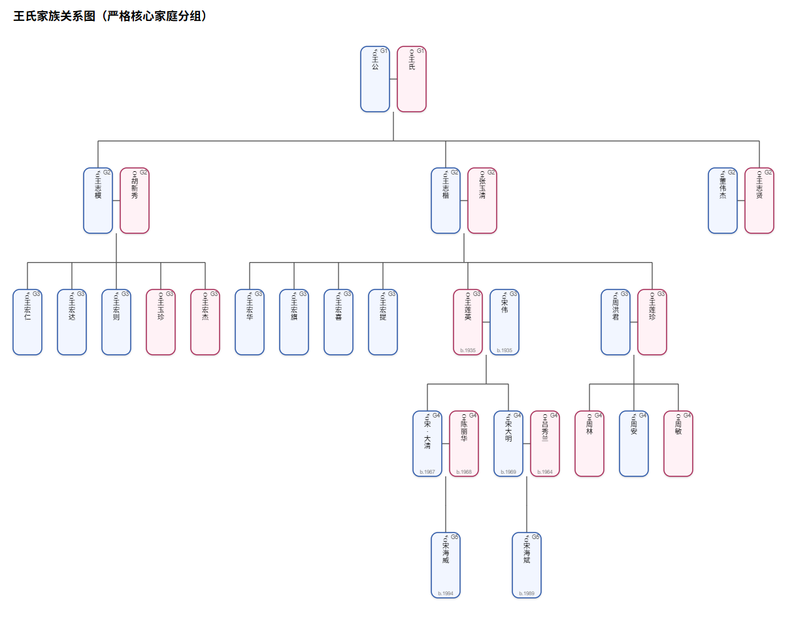

# Simple Family Tree ([中文](#家谱应用程序))



This is a client-side family tree application built using HTML, CSS, and JavaScript. 
## Completely local and private!


### Features

- Load and save family tree data in JSON format
- Add new people to the family tree
- Search for people by name
- View and edit person details
- Add and edit person names and events (including custom event types)
- Visualize the family tree in a hierarchical layout (Cytoscape.js)
- Generate strict nuclear-family SVG tree diagrams directly in the browser
- Undo changes (Ctrl+Z or button)
- Print / HTML export with embedded graph and member table
- Bilingual UI — English (`index.html`) and Chinese (`index_zw.html`)

### How to Use

Download the repository to your local folder, then open `index.html` (English) or `index_zw.html` (中文) in a browser.

1. Use the **Add New Person** button to add people to the family tree.
2. Or load an existing JSON file (see `examples/example_ft_1.json`) with the **Load Family Tree** button.
3. Use the search bar to find people by name.
4. Click on a person in the graph or search results to view and edit their details.
5. Use the **Save** button to download the current family tree data as JSON.
   <br>Note: the file is saved to your browser's download folder.
6. Use **SVG Tree** to generate a strict nuclear-family SVG diagram in a new tab (with download option).
7. Use **Print** to open an HTML page with the Cytoscape graph and a member table.
8. Use **Undo** (or Ctrl+Z) to revert the last edit.

### Project Structure

```
index.html          – English UI entry point
index_zw.html       – Chinese (中文) UI entry point
style.css           – Application styles

app.js              – Main orchestrator (state, DOM, editing, search, file I/O)
i18n.js             – Translations & language detection
utils.js            – Pure helpers (generateId, escapeHtml, getDisplayName, …)
graph.js            – Cytoscape.js graph factory (styling, layout, events)
svgtree.js          – Strict nuclear-family SVG tree layout algorithm

Zupu_json2svg.py    – Standalone Python SVG generator (CLI alternative)
json2svg.bat        – Batch wrapper for the Python script
local_json2svg.bat  – Local batch wrapper
examples/           – Sample JSON family tree files
```

### Technologies Used

- HTML / CSS / JavaScript (vanilla, no build step)
- [Cytoscape.js](https://js.cytoscape.org/) — interactive graph visualisation
- [dagre](https://github.com/dagrejs/dagre) — directed graph layout engine
- [cytoscape-svg](https://github.com/kinimesi/cytoscape-svg) — SVG export from Cytoscape

### Author

This application was created by [VS Code] guided by <a href="mailto:tqye@yahoo.com">TQ Ye</a>.

---

# 简易家谱

这是一个使用HTML、CSS和JavaScript构建的客户端家族谱应用程序。
## 完全本地运行本地储存，确保私密！
---

### 特点

- 加载和保存家谱数据（JSON格式）
- 向家谱中添加新成员
- 按姓名搜索
- 查看和编辑成员详细信息
- 添加和编辑姓名及事件（支持自定义事件类型）
- 以层次结构布局可视化家谱（Cytoscape.js）
- 在浏览器内直接生成严格核心家庭SVG族谱图
- 撤销更改（Ctrl+Z 或按钮）
- 打印 / HTML导出（含关系图和成员表格）
- 双语界面 — 英文（`index.html`）和中文（`index_zw.html`）

### 使用方法

将存储库下载到本地文件夹，然后在浏览器中打开 `index_zw.html`（中文）或 `index.html`（English）。

1. 使用 **添加新成员** 按钮向家谱中添加新人。
2. 或使用 **加载族谱** 按钮加载JSON格式的家谱文件（见 `examples/example_zupu.json`）。
3. 使用搜索栏按姓名查找。
4. 点击图表或搜索结果中的某人来查看和编辑详细信息。
5. 使用 **下载保存** 按钮下载当前家谱数据。<br>注意：文件默认保存到浏览器的下载文件夹。
6. 使用 **SVG族谱图** 在新标签页中生成严格核心家庭SVG图（可下载）。
7. 使用 **打印** 打开含关系图和成员表格的HTML页面。
8. 使用 **撤销**（或 Ctrl+Z）回退上一步编辑操作。

### 项目结构

```
index.html          – 英文界面入口
index_zw.html       – 中文界面入口
style.css           – 应用样式

app.js              – 主程序（状态、DOM、编辑、搜索、文件读写）
i18n.js             – 翻译与语言检测
utils.js            – 纯工具函数（generateId、escapeHtml、getDisplayName 等）
graph.js            – Cytoscape.js 图工厂（样式、布局、事件）
svgtree.js          – 严格核心家庭SVG族谱图布局算法

Zupu_json2svg.py    – 独立Python SVG生成器（命令行方式）
json2svg.bat        – Python脚本的批处理封装
local_json2svg.bat  – 本地批处理封装
examples/           – 示例JSON家谱文件
```

### 使用技术

- HTML / CSS / JavaScript（原生，无需构建工具）
- [Cytoscape.js](https://js.cytoscape.org/) — 交互式图可视化
- [dagre](https://github.com/dagrejs/dagre) — 有向图布局引擎
- [cytoscape-svg](https://github.com/kinimesi/cytoscape-svg) — Cytoscape SVG导出

### 作者

本应用程序由[VS Code]根据<a href="mailto:tqye@yahoo.com">TQ Ye</a>的指导创建。
